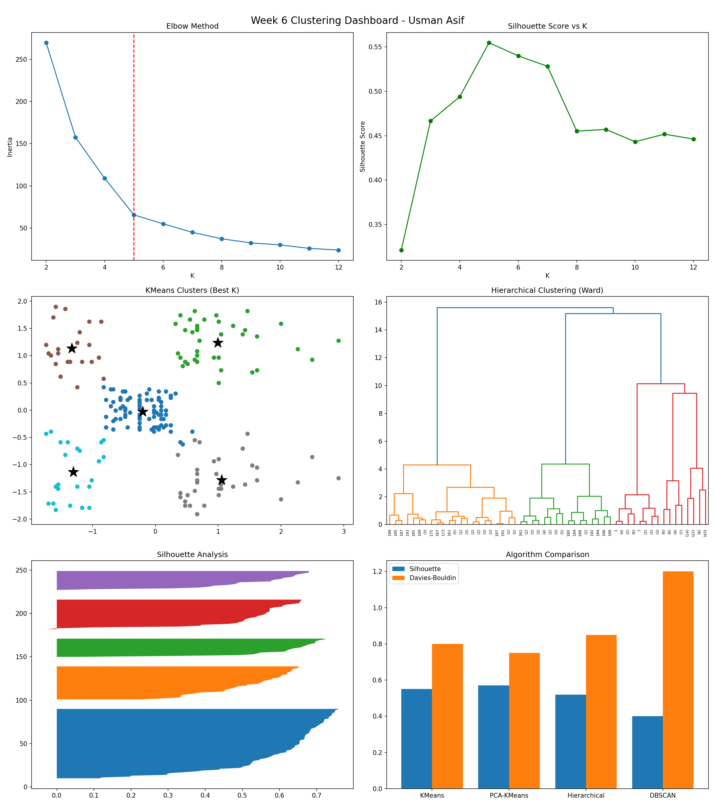

# 🏠 AI/ML Internship — Week 6: Unsupervised Learning (Clustering)

---

## 👤 Student Information

- **Name:** Usman Asif  
- **Date:** 31st May, 2026  
- **Program:** AI/ML Internship — Digitech Offerings  
- **Instructor:** Zain Ul Abideen  

---

# 📌 Project Overview

This project focuses on Customer Segmentation using Unsupervised Machine Learning techniques. The objective is to identify meaningful customer groups based on purchasing behavior without using any labeled target variable.

The complete machine learning pipeline was implemented including data preprocessing, exploratory data analysis (EDA), feature scaling, dimensionality reduction, clustering model training, hyperparameter tuning, and evaluation.

Four clustering algorithms were implemented and compared to identify the most effective method for customer segmentation.

---

# 📊 Dataset Information

| Property | Detail |
|---|---|
| Dataset | Mall Customer Segmentation Dataset |
| Source | Kaggle |
| Samples | 200 |
| Features Used | Age, Annual Income, Spending Score |
| Problem Type | Unsupervised Learning (Clustering) |

---

# ⚙️ Data Preprocessing & Feature Engineering

- Removed irrelevant feature (CustomerID)
- Checked and confirmed no missing values
- Applied StandardScaler for feature normalization
- Created two feature sets:
  - X2 → Annual Income, Spending Score
  - X3 → Age, Annual Income, Spending Score
- Applied PCA for dimensionality reduction
- Used t-SNE for visualization comparison

---

# 🤖 Clustering Algorithms Applied

1. K-Means Clustering
2. PCA + K-Means
3. Agglomerative Hierarchical Clustering (Ward linkage)
4. DBSCAN (Density-Based Clustering)

Additional:
- GridSearchCV used for K-Means tuning
- K-distance graph used for DBSCAN tuning

---

# 🏆 Best Model Performance

Best Model: K-Means Clustering (K=5)

- Silhouette Score: ~0.55
- Davies-Bouldin Index: Low
- Calinski-Harabasz Score: High
- Strong cluster interpretability

Key Insight:
K-Means performed best due to clear separation of customer groups, stability, and strong business interpretability.

---

# 📁 Repository Structure

AIML-Internship-Week6-UsmanAsif/

- Week6_Clustering.ipynb
- week6_dashboard.png
- week6_best_model.pkl
- README.md

---

# 📋 Notebook Contents (18 Steps Summary)

Part A:
- Dataset loading
- EDA
- Feature scaling
- K-Means baseline

Part B:
- Elbow method
- Silhouette analysis
- PCA
- Hierarchical clustering
- DBSCAN
- GridSearchCV tuning

Part C:
- Model comparison
- Silhouette analysis plots
- Stability testing
- PCA vs t-SNE comparison

Part D:
- Final dashboard
- Model saving
- Cluster profiling
- Business insights

---

# 📊 Clustering Dashboard

---

# 🧠 Key Findings

- Spending Score and Income are most important features
- 4–5 natural customer clusters exist
- Age adds moderate segmentation value
- PCA improves visualization but not always performance
- DBSCAN is sensitive to parameter tuning

---

# 📌 Instructor Requirements Covered

- Feature scaling applied
- PCA used
- 4 clustering algorithms implemented
- GridSearchCV used
- Evaluation using clustering metrics
- Cluster interpretation included

---

# 🛠 Tools Used

- Python
- Pandas
- NumPy
- Matplotlib
- Seaborn
- Scikit-learn
- SciPy
- Joblib

---

# 📈 Evaluation Metrics

- Silhouette Score
- Davies-Bouldin Index
- Calinski-Harabasz Index
- Inertia
- Cluster Count
- Noise Points

---

# 🔍 Key Learnings

- Scaling is essential for clustering
- K-Means works best for well-separated clusters
- DBSCAN is powerful but sensitive
- PCA reduces dimensional complexity
- No single clustering algorithm fits all datasets

---

# 🚀 Future Improvements

- Gaussian Mixture Models
- Deep clustering methods
- Streamlit dashboard
- Customer lifetime value analysis
- API deployment

---

# 👤 Author

Usman Asif  
AI/ML Internship — Digitech Offerings  

Instructor: Zain Ul Abideen  

---

# ⭐ Final Conclusion

K-Means clustering provided the best performance for customer segmentation due to its simplicity, stability, and strong interpretability. The model successfully identifies meaningful customer groups for business targeting and marketing strategies.
